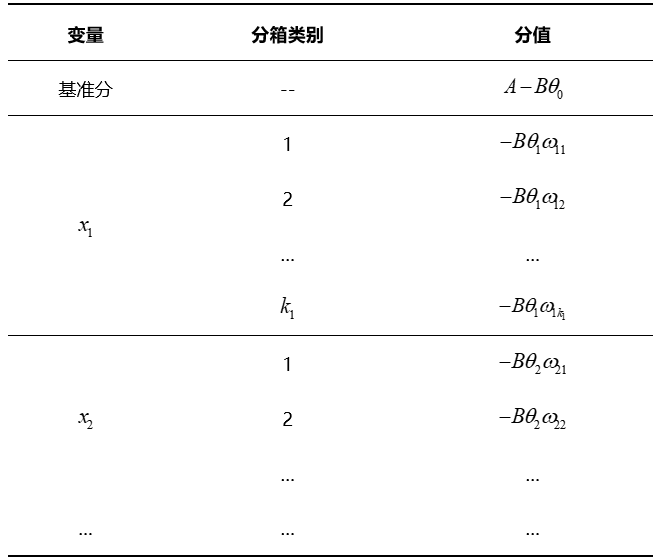

# 标准评分模型

## 1、评分卡简介

信用评分卡模型是最常见的金融风控手段之一，它是指根据客户的各种属性和行为数据，利用一定的信用评分模型，对客户进行信用评分，据此决定是否给予授信以及授信的额度和利率，从而识别和减少在金融交易中存在的交易风险。

评分卡模型在不同的业务阶段体现的方式和功能也不一样。按照借贷用户的借贷时间，评分卡模型可以划分为以下三种：

Ÿ  贷前：申请评分卡（Application score card），又称为**A卡**

Ÿ  贷中：行为评分卡（Behavior score card），又称为**B卡**

Ÿ  贷后：催收评分卡（Collection score card），又称为**C卡**

标准评分卡模型是当前业界使用最多的风控模型，建模后得到的评分卡模型如下：

| **变量名称** | **变量范围**      | **得分** |
| ------------ | ----------------- | -------- |
| 基准分       | --                | 223      |
| 年龄         | 18≤年龄<25        | -2       |
| 年龄         | 25≤年龄<35        | 8        |
| 年龄         | 35≤年龄<55        | 10       |
| 年龄         | 55≤年龄           | 5        |
| 性别         | 男                | 4        |
| 性别         | 女                | 2        |
| 婚姻状况     | 已婚              | 8        |
| 婚姻状况     | 未婚              | -2       |
| 学历         | 硕士，博士        | 10       |
| 学历         | 本科              | 8        |
| 学历         | 大专              | 5        |
| 学历         | 中专，技校，高中  | 1        |
| 学历         | 初中，小学        | -2       |
| 月收入       | 月收入<3000       | -8       |
| 月收入       | 3000≤月收入<5000  | 0        |
| 月收入       | 5000≤月收入<8000  | 5        |
| 月收入       | 8000≤月收入<12000 | 13       |
| 月收入       | 12000≤月收入      | 20       |

评分卡模型如何对用户进行评分呢？一个用户的总评分等于基准分加上对客户各个属性的评分。以上面的评分卡为例：
$$
客户评分=基准分+年龄评分+性别评分+婚姻状况评分+学历评分+月收入评分
$$
如果某客户年龄为27岁，性别为男，婚姻状况为已婚，学历为本科，月收入为10000，那么他的评分为:
$$
223（基准分）+8（年龄评分）+4（性别评分）+8（婚姻状况评分）+8（学历评分）+13（月收入评分）= 264
$$

## 2、评分卡的开发流程

信用评分卡的开发有一套科学的、严密的流程，包括数据获取，EDA，数据预处理，变量筛选，LR模型的开发和评估，生成评分卡模型以及布置上线和模型监测。典型的开发流程如下图所示：

## 3、探索性数据分析

有些时候建模人员一拿到数据就直接开始上手建模，事实并非如此。第一步应该是分析数据，并把数据转化为可用的信息。分析数据就是通常所说的EDA，转化数据包括在数据预处理部分。

EDA操作主要是分析样本总体的大概情况，描述样本总体情况的指标主要有直方图、箱形图等。单变量的分布要大致呈正态分布，才能够满足后续分析的条件。多变量之间的相关性要尽可能低。检查完后切分数据集，将训练数据切分，用于检验。

> 探索性数据分析工具：DataPrep、Pandas Profiling、SweetViz、AutoViz。

## 4、数据预处理

该环节主要是为了将获取的原始数据转化为可用作模型开发的数据。数据处理可以概括为：缺失值处理、数据类型转换、去除逻辑错误和去除业务无关变量几部分：

Ÿ  **缺失值处理**：处理方式可以分为填补和删除。填补缺失值需根据实际字段的业务含义，通常可以用0、均值、众数和KNN算法填充。但是，在金融风控场景下，缺失值可能本身就是一种有业务含义的字段，可以考虑单独作为一个类别。当一个字段缺失值超过一半或更多的时候，一般考虑删除。

Ÿ  **数据类型转换**：一般指的是本应该是数值型的却被存成了字符型，或者日期格式不正确等，可以按照实际需求进行转换。

Ÿ  **去除逻辑错误**：一般是指去除异常值，比如一个借款客户的年龄为168岁，这显然是不合理的。对于违反常识或者严重离群的数据点，结合字段的实际含义去除异常值。

Ÿ  **去除业务无关变量**：最常见的一些会被去掉的字段，就是在一些客户资质比较差的场景下，用户手动填写的数据。如：收入、家庭人数、学历等。因为这些很可能是用户随便填写的，噪声很大。

## 5、特征分箱

**（1）Split分箱：决策树分箱**

Split分箱是一种**自上而下**(即基于分裂)的数据分段方法。如下图所示，Split分箱和决策树比较相似，切分点的选择指标主要有 entropy，gini 指数和 IV值等。

                   

**（2）Merge分箱：卡方分箱**

Merge分箱是一种**自底向上**(即基于合并)的数据离散化方法。如图4.3所示，Merge分箱常见的类型为卡方分箱。

 

**（3）特征分箱的优势**

Ÿ  特征分箱可以有效处理特征中的缺失值和异常值。

Ÿ  特征分箱后，数据和模型会更稳定。

Ÿ  特征分箱可以简化逻辑回归模型，降低模型过拟合的风险，提高模型的泛化能力。

Ÿ  将所有特征统一变换为类别型变量。

Ÿ  分箱后变量才可以使用标准的评分卡格式，即对不同的分段进行评分。

## 6、WOE编码

**（1）WOE编码**

分箱之后我们便得到了一系列的离散变量，下面需要对变量进行编码，将离散变量转化为连续变量。WOE编码是评分卡模型常用的编码方式。

WOE 称为证据权重(weight of evidence)，是一种有监督的编码方式，将预测类别的集中度的属性作为编码的数值。对于自变量第i箱的WOE值为：

其中，  $p_{i1}$是第i箱中坏客户占所有坏客户的比例；

  $p_{i0}$是第i箱中好客户占所有好客户的比例；

  $\#B_i$是第i箱中坏客户的人数；

  $\#G_i$是第i箱中好客户的人数；

  $\#B_T$是所有坏客户的人数；

  $\#G_T$是所有好客户的人数；

变换以后可以看出，WOE也可以理解为当前分箱中坏客户和好客户的比值，和所有样本中这个比值的差异 (也就是我们随机的坏客户和好客户的比例)。WOE越大，这种差异越大，当前分组里的坏客户的可能性就越大，WOE越小，差异越小，这个分组里的样本响应的可能性就越小。当分箱中坏客户和好客户的比例等于随机坏客户和好客户的比值时，说明这个分箱没有预测能力，即WOE=0。

Ÿ  WOE是正值，相对于未分组，能识别更多的违约。

Ÿ  WOE是负值，相对于未分组，能识别更多的不违约。

因此，WOE的符号代表分组在违约还是不违约情况下有相对优势，而WOE的绝对值越大优势就越明显。

WOE具体计算过程如下表所示：

**（2）WOE编码的优势**

Ÿ  可提升模型的预测效果

Ÿ  将自变量规范到同一尺度上

Ÿ  WOE能反映自变量取值的贡献情况

Ÿ  有利于对变量的每个分箱进行评分

Ÿ  转化为连续变量之后，便于分析变量与变量之间的相关性

Ÿ  与独热向量编码相比，可以保证变量的完整性，同时避免稀疏矩阵和维度灾难。

## 7、特征筛选

### 7.1 预测能力

在筛选变量时，特征对目标变量的预测能力是首要考虑的内容，模型的效果主要取决于变量的预测力。这里总结几种常用的筛选变量的方法：

#### 7.1.1 IV值筛选

IV称为信息价值(information value)，是目前评分卡模型中筛选变量最常用的指标之一，自变量的IV值越大，表示自变量的预测能力越强。类似的指标还有信息增益、基尼(gini)系数等。常用判断标准如下表：

| **IV**范围 | **预测能力** |
| ---------- | ------------ |
| <0.02      | 无效         |
| 0.02-0.10  | 弱预测能力   |
| 0.10-0.20  | 中预测能力   |
| >0.20      | 强预测能力   |

计算变量中第i个分箱对应的 IV 值的计算公式为：

 

变量对应的IV值为所有分箱对应的 IV 值之和：

 

> 从上式我们可以看出变量的 IV 值实际上是变量各个分箱的加权求和。且和交叉熵的计算过程有异曲同工之妙。以下为交叉熵公式：
>
>  

IV值的具体计算流程如下表：

#### 7.1.2 stepwise筛选

基于stepwise的变量筛选方法也是评分卡中变量筛选最常用的方法之一。具体包括三种筛选变量的方式：

Ÿ  前向选择forward：逐步将变量一个一个放入模型，并计算相应的指标，如果指标值符合条件，则保留，然后再放入下一个变量，直到没有符合条件的变量纳入或者所有的变量都可纳入模型。

Ÿ  后向选择backward：一开始将所有变量纳入模型，然后挨个移除不符合条件的变量，持续此过程，直到留下所有最优的变量为止。

Ÿ  逐步选择stepwise：该算法是向前选择和向后选择的结合，逐步放入最优的变量、移除最差的变量。

基于stepwise的筛选方法进行特征选择时，可以使用AIC、BIC、KS或AUC作为选择标准。其中，AIC和BIC准则可以在模型复杂度和模型对数据集描述能力之间寻求最佳平衡，通过加入模型复杂度的惩罚项来避免过拟合问题。下面介绍这两种模型选择方法。

**（1）赤池信息准则AIC**

AIC是衡量统计模型拟合优良性的一种准则，它是建立熵的概念上，提供了权衡估计模型复杂度和拟合数据优良性的标准。

通常情况下，AIC定义为：
$$
AIC=2k-2lnL
$$
其中，k是模型参数个数，L是似然函数。从一组可供选择的模型中选择最佳模型时，通常选择AIC最小的模型。

当两个模型之间存在较大差异时，差异主要体现在似然函数项，当似然函数差异不显著时，式中第一项，即模型复杂度会起作用，从而表明参数个数少的模型是较好的选择。

一般而言，当模型复杂度提高（k增大）时，似然函数L也会增大，从而使AIC变小，但是k过大时，似然函数增速减缓，导致AIC增大。模型过于复杂容易造成过拟合现象。

所以目标就是选取AIC最小的模型，AIC不仅要提高模型拟合度（极大似然），而且要引入惩罚项，使模型参数尽可能少，从而降低过拟合的可能性。

**（2）贝叶斯信息准则BIC**

BIC与AIC相似，更多地用于模型选择。训练模型时，增加参数数量，也就是增加模型复杂度，会增大似然函数，但是也会导致过拟合现象，针对该问题，AIC和BIC均引入了与模型参数个数相关的惩罚项，BIC的惩罚项比AIC的大。同时要考虑样本数量，样本数量过多时，可有效防止模型精度过高造成的模型复杂度过高。
$$
BIC=klnn-2lnL
$$
其中，k为模型参数个数，n为样本数量，L为似然函数。  惩罚项在维度过大且训练样本数量相对较少的情况下，可以有效避免出现维度灾难现象。

#### 7.1.3 特征重要度筛选

随机森林计算特征重要度的步骤：

Ÿ  对每一颗决策树，选择相应的袋外数据（OOB）计算袋外数据误差，记为$err_{OOB1}$；

Ÿ  随机对袋外数据OOB所有样本的特征加入噪声干扰(随机的改变样本在该特征的值)，再次计算袋外数据误差，记为$err_{OOB2}$；

Ÿ  特征的重要度=${1\over N}\sum(err_{OOB2}-err_{OOB1})$，N 表示随机森林中决策树的个数。

当改变样本在该特征的值，若袋外数据准确率大幅度下降，则该特征对于样本的预测结果有很大影响，说明特征的重要度比较高。

**GBDT计算特征重要度的原理：**

特征 j 在单颗树中的重要度的如下：

$$\hat J^2_{j}(T)= \sum\limits_{t=1}^{L-1}{\hat i^2_{t}1(v_{t}=j)}$$

其中，L 为树的叶子节点数量；L-1 为树的非叶子节点数量；$v_t$是和节点 t 相关联的特征；$i_t^2$是节点 t 分裂之后平方误差的减少值。

特征j的全局重要度为特征j在单颗树中的重要度的平均值：

 $$\hat J^2_{j}(T)= {1\over M}\sum\limits_{m=1}^{M}{\hat J^2_{j}(T_m)}$$

其中，M是树的数量。

#### 7.1.4 LASSO正则化筛选

L1正则化通常称为Lasso正则化，它是在代价函数上增加了一个L1范数：

 $$J(\theta)=-\sum\limits_{i=1}^{M}(y^{(i)}log(h_{\theta}(x^{\{i\}}))+(1-y^{(i)})log(1-h_{\theta}(x^{\{i\}})))+{\lambda\over{m}}\sum\limits_{j=1}^{n}|\theta_j|$$

L1正则化能起到使参数更加稀疏的作用，稀疏化的结果使优化后的参数一部分为0，另一部分为非零实值。非零实值的那部分参数可起到选择重要参数或特征维度的作用，同时可起到去除噪声的效果。

#### 7.1.5 两两相关性分析

对于自变量$X_1,X_2$，如果存在常数$c_0,c_1,c_2$使得以下线性等式近似成立：

 $$c_1X_1 + c_2X_2 \approx c_0$$

称自变量$X_1,X_2$具有较强的线性相关性。

两变量间的线性相关性可以利用皮尔森相关系数来衡量。系数的取值为[-1,1]，相关系数越接近0的说明两变量线性相关性越弱，越接近1或-1两变量线性相关性越强。

当两变量间的相关系数大于阈值时（一般阈值设为 0.7），剔除IV值较低的变量，或分箱严重不均衡的变量。

#### 7.1.6 多重共线性分析

对于自变量$X_1,X_2,...,X_n$，如果存在常数$c_0,c_1,c_2,...,c_n$使得以下线性等式近似成立：

$$c_1X_1+c_2X_2+...+c_nX_n=c_0$$

称自变量$X_1,X_2,...,X_n$具有较强的多重共线性。

通常用VIF值来衡量一个变量和其他变量的多重共线性：

$$VIF_i={1\over{1-R^2_i}}$$

其中，$R_i$为$X_i$与其他自变量的复相关系数。

其中，  为其他变量的线性表示。

$\hat X_i$为变量$X_i$的均值。

当某个变量的VIF大于阈值时（一般阈值设为10 或 7），需要逐一剔除解释变量。当剔除掉$X_k$时发现VIF低于阈值，则从$X_k$和$X_i$中剔除IV值较低的一个。

> **为什么要进行相关性分析？**  
>
> 设想建立一个具有两变量$X_1$和$X_2$的线性模型，真实模型是$Y=X_1+X_2$。如果$X_1$和$X_2$线性相关（比如说     $X_1 \approx 2X_2$），那么拟合模型$Y=3X_2$,  $Y=2X_1-X_2$或$Y=51X_1-99X_2$的效果都一样好，理想状态下，系数权重会有无数种取法，使系数权重变得无法解释，导致变量的每个分段的得分也有无数种取法（后面我们会发现变量中不同分段的评分会用到变量的系数）。 
>
> 即使不进行线性相关性分析也不会影响模型的整体性能，进行相关性分析只是为了让我们的模型更易于解释，保证不同的分箱的得分正确。  
>
> **决策树、随机森林的多重共线性问题：**  
>
> 多重共线性的特征不会对决策树、随机森林的预测能力有影响，但是数据的解释性会被多重共线性影响。随机森林可以返回特征的重要性（importantce），当有多重共线性时，importance会被影响。一些具体多重共线性的特征的重要性会被相互抵消，从而影响我们解释和理解特征。比如说，特征A和B完全一样，我们在用随机森林时，它们的重要性应该非常接近（考虑到随机性）。如果我们在训练前删除特征B，那么特征A的重要性就会翻番。这一下子就影响了我们对特征、数据的理解。。  

### 7.2 稳定性

在模型中使用不稳定的变量，可能会影响样本人群的代表性和评分的稳定性。通常通过计算变量在开发样本和跨时间样本上的群体稳定性指标（PopulationStability Index，即PSI）对变量的稳定性进行评估。PSI的计算公式如下：

 

其中：PSI是对两个日期的特征数据进行计算，可以任选其一作为base集，另一则是test集（也可称为expected集和actual集），用字母i表示第i个分段区间。

特征的PSI计算过程如下：

（1）  特征取值等频分段：对这个特征在base集的取值进行等频划分（通常等频分10份即可）。

（2）  计算$p^i_{base}$：统计落在每个分段区间内的目标数量，进一步得到数量占比，表示该特征在base集中第i个取值分段中的数量占比。

（3）  计算$p^i_{test}$：按照（2）中的方式计算test集的$p^i_{test}$。需要注意的是，分段还是采用第1步得到的分段（依据base集的分段）。

（4）  根据公式即可计算得到该特征基于这两个日期的PSI。

通常，如果一个特征跨度6个月的PSI取值小于0.1，那么这个特征被认为是稳定的（当然，也可以根据具体情况适当放宽0.1的标准）。

注意：并非所有PSI值很高的特征都不能用于建模，如果一个特征区分度很好但PSI值不满足预期（比如跨度6个月的PSI大于0.1），但同时，该特征的取值波动性从业务的角度可以解释得通，那么这样的特征用于建模也是可以的。

### 7.3 单调性

通常情况下，单个变量在模型中的作用必须具有单调性。变量好坏分布的单调性越强，定量模型的性能将越好。在现实数据中，完全单调的情况是很少出现的，更多的情况是在总体趋势保持单调的同时，存在一定波动。模型开发一般采用将坏帐率接近、业务同质性高的群体合并来对变量分箱(classing)，以帮助业务人员理解总体趋势。

在特征分箱后，一般通过可视化的方式度量变量的单调性，如果分箱方式不满足单调性的要求，可调整分箱。如下图所示为某变量分箱后，训练集和测试集下每一箱对应的坏样本率，可以看到图中的第一箱和第二箱的bad_rate存在倒挂，说明bad_rate不单调，需要进行调整。可以尝试将第一箱和第二箱进行合并。

 

调整分箱后的bad_rate如下图2所示，bad_rate单调：

 

绘制该变量每一箱的样本比例和bad_rate，如下图所示：

 

### 7.4 业务合理性

定量评分模型需要注重模型变量的业务合理性和解释性，鉴于风险控制的严谨性，在风险建模中更要特别慎重。然而，出于种种已知或未知的原因，统计上显著的变量，其在定量模型中的作用不一定与常识和业务经验一致。为了避免由此可能导致的错误决策，模型开发需参考业务部门的意见和建议，确保变量在不同取值下，好坏分布的总体趋势与业务经验一致。

### 7.5 特征筛选的作用

建模之前的特征筛选通常会进行两次，第一次会在特征分箱之前进行粗筛选，排除没有预测能力的变量；第二次会在特征分箱后进行细筛选，筛选出预测能力强，具有单调性，且业务上可解释的变量。特征筛选在建模过程中非常重要，一般来说具有如下好处：

Ÿ  剔除跟目标变量不太相关的特征

Ÿ  消除由于线性相关的变量，避免特征冗余

Ÿ  减轻后期验证、部署、监控的负担

Ÿ  保证变量的可解释性

## 8、逻辑回归模型

构建初步的逻辑回归模型，根据p-value进行变量筛选，根据各个变量的系数符号进行筛选，得到最终的逻辑回归模型。

由于逻辑回归模型具有简单，稳定，可解释性强，技术成熟和易于检测和部署等优势，逻辑回归是标准评分卡所使用的算法。

### 8.1 变量系数符号筛选

检查逻辑回归模型中各个变量的系数，如果所有变量的系数均为正数，模型有效。假如有一些变量的系数出现了负数，说明有一些自变量的线性相关性较强，需要进一步进行变量筛选。通常的做法是：

（1）  综合考虑变量的IV值和业务建议，按照变量的优先级进行降序排列；

（2）  选择优先级最高的4-5个基本变量；

（3）  按优先级从高到低逐渐添加变量，当新添加的变量之后，出现系数为负的情况，舍弃该变量；

（4）  直到添加最后一个变量。

### 8.2 变量p-value筛选

p-value是假设检验的里面的概念。模型假设某自变量与因变量线性无关，p-value可以理解为该假设成立的可能性 (便于理解，不太准确)。一般，当p-value大于阈值时，表示假设显著，即自变量与因变量线性无关；当p-value小于阈值时，表示假设不显著，即自变量与因变量线性相关。阈值又称为显著性水平，通常取0.05。

因此，当某个字段的p-value大于0.05时，应该删除此变量。

## 9 生成标准评分卡

### 9.1 评分转换

我们将客户违约的概率表示为p，则正常的概率为1-p。由逻辑回归的基本原理可得：

整理以上公式：

我们可以定义比率来表示客户违约的相对概率：

将odds带入可得：

评分卡的分值可以定义为比率对数的线性表达来，即：

其中，A与B是常数，B前面的负号可以使得违约概率越低，得分越高。通常情况下，即高分值代表低风险，低分值代表高风险。

A、B的值可以通过将两个已知或假设的分值带入计算得到。通常情况下，需要设定两个假设：

Ÿ  某个特定的违约概率下的预期评分，即比率odds为  时的分数为  ；

Ÿ  该违约概率翻倍的评分（PDO）；

根据以上的分析，则odds为  时的分数为  ，代入以上线性表达式，可得：

解该方程组，可得：

在实际的应用中，我们会计算出每个变量的各分箱对应的分值。新用户产生时，对应到每个分箱的值，将这些值相加，最后加上初始基础分，得到最终的结果。

式中：变量  是出现在最终模型的入模变量。由于所有的入模变量都进行了WOE编码，可以将这些自变量中的每一个都写作  的形式：

其中，  为基础分数；  为逻辑回归中第  个自变量的系数；  为第  个变量的第  个分箱的WOE值，  是0，1逻辑变量，当  代表自变量  取第  个分箱，当  代表自变量  不取第  个分箱。最终得到下表所示的评分卡模型的评分表：

从以上公式中，我们发现每个分箱的评分都可以表示为$-B(\theta_i\omega_{ij})$，也就是说影响每个分箱的因素包括三部分，分别为参数B，变量系数$\theta_i$，和对应分箱的WOE编码$\omega_{ij}$。

### 9.2 评分卡生成

在进行评分映射的时候，通常采用如下公式：

 

其中，当Odds=10时，基础分score=600，PDO=20。

一个用户的总评分等于基准分加上对客户各个属性的评分。以表中的评分卡为例，某客户年龄为27岁，性别为男，婚姻状况为已婚，学历为本科，月收入为10000，那么他的评分为:

$$223（基准分）+8（年龄评分）+4（性别评分）+8（婚姻状况评分）+8（学历评分）+13（月收入评分）= 264$$

 

## 10 模型评估

（1）回归结果检查

由于WOE与违约概率之间存在着某种反向趋势，在此基础上，我们可以预料到模型拟合出来的自变量系数应该都是正数，如果结果中出现了负数，应当考虑是否是来自自变量多重共线性的影响。

为了检测定量模型的预测变量间是否存在严重的多重共线性，通常运用线性回归过程计算方差膨胀系数（Variance Inflation Factor）。VIF表示的是某个自变量能被其它自变量解释的程度，VIF值越高，多重共线性越严重。一般设定VIF值不高于10。若存在严重的多重共线性，则根据P值（显著性检验p值>0.05）将最不显著的变量予以删除。

若各个变量的VIF值都远远小于10，则说明上述模型中的变量都未出现显著的多重共线性。

（2）模型评估指标及应用场景

一般采用准确率、召回率、KS值、AUC值、Gini系数、提升（lift）指数来评价模型的区分能力/预测能力。

- **准确率**

对于二分类任务，准确率是最常用的评价指标，介绍评价指标之前需要先了解“混淆矩阵”，如下表所示：

其中：TP (真正例)：将正类预测为正类数；TN (真负例)：将负类预测为负类数；FP (假正例)：将负类预测为正类数；FN (假负例)：将正类预测为负类数；

精确率(precision)的计算公式为：

$$p={TP\over{TP+FN}}$$

精确率是针对预测结果而言的，表示模型预测为正的样本中有多少比例是真正的正样本。

- **召回率**

召回率(recall)计算公式为：

$$P={TP\over {TP+FN}}$$

召回率是针对原来的样本而言的，表示样本中的正例有多少比例被预测正确。

- **KS值**

KS是使用同一评分标尺下，累计好客户百分比与坏客户百分比的最大差距，如图5所示KS值为0.37。通常评分越低客户表现越坏，而评分越高客户的表现越好。如果评分区分好坏客户的能力越高，KS就会越高。理论上KS的取值在0-100%之间，常见的评分卡KS的取值范围多在25%-75%之间。KS值达到28%以上，认为模型有效。KS值常用于风控模型评估。

- **AUC**

ROC曲线是评价风控模型好坏的重要手段。它是通过在0到1之间改变混合矩阵的临界值，绘制分类准确的违约记录比例（TPR）与分类错误的正常记录比例（FPR）而得到的，如图5所示。

鉴于ROC曲线的定义，对角线以上的图形越高，模型就越好。ROC曲线之下的面积被称为AUC统计量，AUC值越大，建立的评分卡越可靠。AUC值达到0.70，认为模型有效。

- **Gini系数**

Gini系数是以累计的好客户和坏客户为坐标的曲线下面积（0和0.5之间）与0.5的比值。Gini系数越高，说明评分卡的区分能力越强。Gini系数等于0说明评分卡没有任何区分能力，Gini系数等于100%则是理论上完美的评分卡。Gini系数用作风控模型评价指标。

- **提升指数**

提升指数常用作营销模型的评价指标，衡量的是，与不利用模型相比，模型的预测能力变好了多少。不利用模型时，营销成功概率可用样本的营销成功比例来做估计值。建立营销模型的目的是提高营销成功的概率，减少营销成本。因此常将模型预测概率降序排列取出top10%的样本作为营销对象，统计这些营销对象中实际营销成功的比例，若top10%的样本中有60%的营销成功样例，而建模样本中的营销成功样例仅有20%，则提升指数=3，lift越大，模型效果越好。

（3）模型排序能力

模型的排序能力是指将人群按评分从低到高分组排序后，高分段组别的坏帐率应小于底分段组别。评分与坏帐率之间应存在单调递减的关系。一个较好的评分卡很少发生低分段组别的坏帐率低于高分段组别坏帐率的现象，即排序能力的跳动。如果这种跳动在很多组别发生，说明评分卡的排序能力存在问题。

如图所示，随着分数的上升，人群的坏账率呈现逐渐下降趋势，模型具有较好的排序能力。

（4）跨时间验证

模型建立完成后，可按期对最新时点的数据进行监控，具体包括以下内容：

•  评分分布的稳定性检验

•  评分变量的稳定性检验

稳定性指数（PSI）用于测量评分或变量在开发时点和验证时点群体的分布是否保持基本一致。明显的分布变动可能导致建模时点的评分或变量对当前的人群已经不再适用。

群体稳定性系数PSI用于显示，与开发样本比较，当前群体是否有时间上的变更。若评分分布和评分变量的稳定性发生较大变化，则需考虑调整更新模型，避免模型预测效果降低。

（5）BCR和解释性

在贷中评分卡设计之中，我们考虑到的不仅仅是贷款笔数的逾期水平，同样更重要的要考虑到最终贷款金额逾期的情况。这种观察指标主要是BCR（Balance Control Ratio），这个指标在常见的消费金融领域、信用卡领域都十分重要。特别是在贷中评分卡的运用上，一定要认识到贷中评分卡的使用会导致BCR发生如何的变动，以及分数调整对BCR的敏感程度。假设分数调整虽然能够降低今后贷款笔数的逾期率，但会导致BCR的显著提升，最终导致金额逾期率的上涨，那么这种分数的调整就需要进行重新斟酌。

同样另外一个需要值得关注的是贷中评分卡的可解释性，这是因为，贷中评分卡主要涉及的是已经成熟在金融机构有过多笔还款的客户，这部分客户已经和金融机构有着一定的合作关系，如果贸然直接使用不可解释的模型进行风控，则会导致已有客户的大量投诉和反馈。如果客户将这种反馈意见反映至银监会、互联网等机构，会导致金融机构声誉的下降，同时也会对现有客户造成一定的负面影响，从而导致逾期率的提升，所以贷中评分卡的可解释性也是十分关键的。

## 11 评分应用策略

客户需求随时间改变，很可能会要求更高额度。这种现象很正常，刚开始给予客户的初始额度偏保守，维持客户关系一段时间后，账户表现会显示一个较为明确的发展方向，贷款机构也逐渐更接受客户，授予更高的额度，这时贷中评分卡就会发挥作用。

有些贷款机构通过设置一些简单的规则来进行调额，但是结合客户使用率和贷中评分卡的风险评分进行决策更加科学，这种决策方式的表现如图7所示：

注：低使用率、高风险的客户不太可能出现，这里不在考虑范围内。

按照风险（评分）和使用情况的不同表现，可以将客户分为三个类别：重要保持客户、重要发展客户和风险客户，针对不同的表现可以采取不同的应对策略。

Ÿ  重要保持客户：图7中低风险、高收益的目标客户。这类客户是最为理想的客户类型，对贷款机构贡献最大，应当优先投放资源，比如提高额度，开展免息、还款容时容差等优惠政策。尽量提高这类客户的忠诚度和满意度，尽可能延长这类客户的高水平消费。

Ÿ  重要发展客户：图7中低风险、低收益的激励客户。这类客户的当前价值虽然不是很高，但却有很大的发展潜力。贷款机构要尽量激励这类客户的消费，通过提升客户的行内等级，加强这类客户的满意度，通过增加餐饮、旅游优惠券、积分奖励等措施，提高这类客户的消费水平。

风险客户：图7中高风险、高收益的避免客户。这类客户虽然对贷款机构的贡献较大，但风险也很高，应尽量避免这类客户的违约风险，比如采取降低额度、限制现金分期等其他产品的行为，避免贷款机构出现较大损失。

 